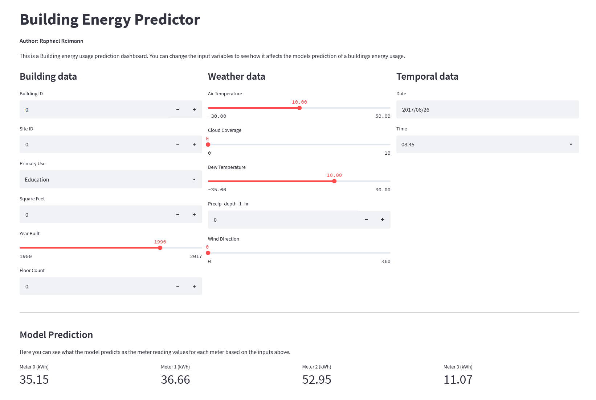
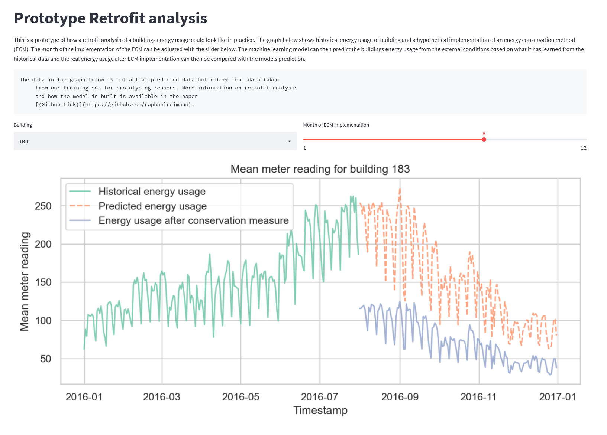

# Research Paper Predictive Analytics

**Author: Raphael Reimann**

## Notebooks

This is the associated code to the research paper "ASHRAE Great Energy Predictor III". To replicate this make sure you install all the necessary dependencies through conda with

```
conda env create -f ashrae.yml
```

Then download the dataset from Kaggle with [this link](https://www.kaggle.com/c/ashrae-energy-prediction/data). Adjust the path to the data in the notebooks `01 Data Understanding.ipynb` and `02 Modeling.ipynb` as well as `ashrae_dashboard.py` if you are running the web application.

## Web Application

To showcase the machine learning models in an applied way, a web application was created. To run it locally run

```
streamlit run ashrae_dashboard.py
```



